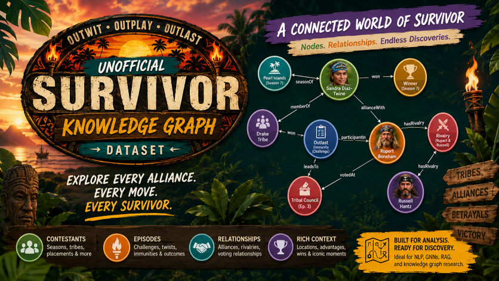

# Survivor Knowledge Graph




A comprehensive RDF/JSON-LD knowledge graph covering all 50 seasons of Survivor (US), from Borneo (2000) through In the Hands of the Fans (2026). 17,000+ triples across 749 named graphs, with 728 contestants and 98 returning players identity-linked.

## Current state (v0.3.0)

| Metric            | Coverage             |
| ----------------- | -------------------- |
| Seasons           | 50/50 (100%)         |
| Episode titles    | 692/699 (99.0%)      |
| Episode air dates | 698/699 (99.9%)      |
| Tribal councils   | 645/699 (92.3%)      |
| Challenge data    | 158/699 (22.6%)      |
| Viewership        | 246/699 (35.2%)      |
| Boot orders       | 49/50 (98%)          |
| Contestants       | 728 unique           |
| Returning players | 98 canonical persons |
| RDF triples       | 17,496               |
| Tests             | 49/49 passing        |

7 seasons with full per-episode detail: S1 Borneo, S7 Pearl Islands, S16 Micronesia, S20 Heroes vs. Villains, S31 Cambodia, S41, S47.

## Quick start

```bash
make install     # rdflib, pyld, pyshacl, pytest
make generate    # create data/ tree (50 seasons, ~700 episodes)
make expand      # JSON-LD to RDF (TriG + N-Quads)
make test        # 26 tests
make validate    # SHACL validation
make stats       # coverage report
```

## Repository structure

```
context/          JSON-LD contexts (season, episode, provenance)
ontology/         OWL ontology (survivor.ttl) + DCAT dataset (dataset.ttl)
shapes/           SHACL shapes with tiered validation
data/             50 season dirs, each with season.json + e01..eNN.json
  persons.json    Cross-season identity registry (98 returning players)
  analytics.json  Pre-computed analytical summaries
queries/          SPARQL analytical query library (16 queries)
scripts/          Data generation, RDF expansion, enrichment, SPARQL runner
research/         Provenance records (PROV-O JSON-LD)
tests/            pytest suite (structure, data, RDF, SPARQL)
docs/             Instructions, roadmap (5 phases), ontology considerations
```

## Ontology alignment

The ontology (v0.3.0) aligns with:

- **schema.org**: Season/Episode/Contestant map to TVSeason/TVEpisode/Person
- **FOAF**: contestant names via foaf:name
- **Dublin Core**: dates, descriptions, publishers
- **DCAT/VoID**: dataset-level metadata with class partitions and statistics
- **PROV-O**: enrichment provenance tracking

17 OWL classes, 40+ properties (incl. 7 idol-specific), 13 SHACL node shapes with tiered validation (Tier 1: title/date, Tier 2: elimination, Tier 3: challenges/votes/events).

## SPARQL queries

22 analytical queries (incl. 6 idol-specific) in `queries/analytical.sparql` covering data quality, winner analysis, contestant networks, game structure evolution, viewership trends, and elimination patterns.

```bash
python scripts/run_queries.py --list     # list all queries
python scripts/run_queries.py --query Q4 # run specific query
python scripts/run_queries.py            # run all
```

## Data provenance

All enrichment sources tracked via PROV-O in `research/provenance/`. Primary sources: Wikipedia season/episode articles (confidence 0.95-0.97), epguides.com (0.98), Survivor Wiki/Fandom (0.90), algorithmic derivation from boot orders (0.80).

## Graph viewer

Interactive force-directed graph visualization of the Survivor knowledge graph. Deployed to GitHub Pages via CI.

Features: force/radial/chronological layouts, search, node inspection, neighborhood expansion (1-2 degree), type filtering, zoom/pan.

```bash
python scripts/extract_graph.py  # extract LPG from JSON-LD
open docs/index.html             # standalone viewer (d3.js)
```

The viewer shows 158 nodes (50 seasons + 108 returning players) connected by 342 edges (returning player links between seasons + identity links). Click any season to see its connections; click a returning player to see their trajectory across seasons.

## Contributing

See [docs/instructions.md](docs/instructions.md) for the research pipeline. See [CHANGELOG.md](CHANGELOG.md) for version history.

## License

Data compiled from public sources. Ontology and tooling: MIT.